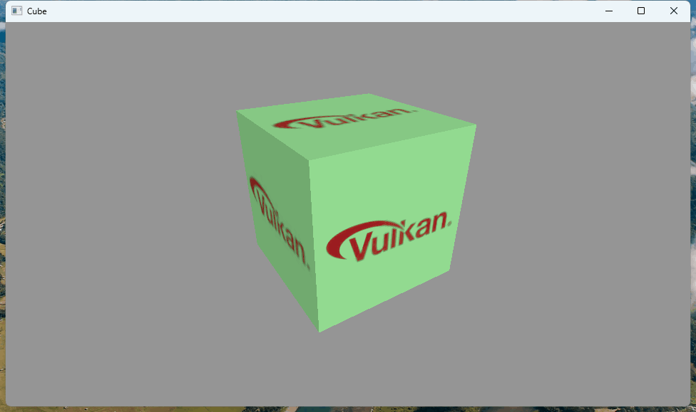

# covk

[](LICENSE-MIT)
[](https://blog.rust-lang.org/2023/04/20/Rust-1.93.0.html)

Unsafe Vulkan bindings for Rust

- `no_std` support
- Vulkan `1.0` `1.1` `1.2` `1.3` `1.4`

- `covk`

  [](https://crates.io/crates/covk)
  [](https://docs.rs/covk)

  Original bindings, pure vulkan style.

- `covk_sys`

  [](https://crates.io/crates/covk_sys)
  [](https://docs.rs/covk_sys)

  - Rust style wrapping
  - Prelude
    ```rust
    use covk::prelude::*;
    ```
  - The vulkan loader
    ```rust
    let vk = Vulkan::new()?;
    ```
  - Return the `Result`
    ```rust
    // function signature
    pub unsafe fn create_instance(
        &self, create_info: &vk::InstanceCreateInfo,
        // allocation_callbacks have been hidden, if you need should use covk_sys or other crate
    ) -> Result<vk::Instance>;

    let inst: vk::Instance = vk.create_instance(&info)?;
    ```
  - NonNull handles
    ```rust
    // vk::Instance
    pub struct Instance(pub NonNull<void>);
    ```
  - RAII handles
    ```rust
    // RAII handles are opaque reference counting heap object
    let inst: hnd::Instance = vk.create_instance(&info)?.hnd(&vk);
    // actual hnd::Instance<vk::core>

    // add ref
    let _inst = inst.clone();

    // get the raw handle
    let raw: vk::Instance = inst.raw();
    ```
  - Query the ext
    ```rust
    let sf: hnd::Instance<vk::khr::surface> = inst.ext::<vk::khr::surface>();
    ```
  - `Vec` on enumerate like api
    ```rust
    // function signature
    // you still can check the count
    pub unsafe fn enumerate_instance_layer_properties(
        &self,
        properties: Option<&mut Vec<vk::LayerProperties>>,
    ) -> Result<(u32, vk::Result)>;

    // will be append to vec, not overwritten
    let mut layers = vec![];
    vk.enumerate_instance_layer_properties(Some(&mut layers))?;
    ```
  - Struct builder
    ```rust
    // vk::new include all required fileds
    let app_info: vk::ApplicationInfo = vk::new::ApplicationInfo {
       application_version: 0,
       engine_version: 0,
       api_version: vk::API_VERSION_1_4,
    }.new();
    let mut info = vk::new::InstanceCreateInfo {
        p_enabled_layer_names: &enable_layers,
        p_enabled_extension_names: &enabled_exts,
    }
    // .new or .builder method
    .application_info(&app_info);


    let mut info = vk::DeviceCreateInfo::default()
        .queue_create_infos(&queue_infos)
        .p_enabled_extension_names(&enabled_exts)
        .enabled_features(&mut features.features);

    // push next &mut Self -> &mut Self, or with_next Self -> Self
    info.push_next(&mut features_1_4);
    
    let device: hnd::Device = inst.create_device(adapter, &info)?.hnd(&inst.hnd);
    let sc: hnd::Device<vk::khr::swapchain> = device.ext::<vk::khr::swapchain>();
    let queue: vk::Queue = device.get_queue(main_queue_family, 0);
    ```
  - Object style traits
    ```rust
    pub trait CoreCommandBuffer {
        // required methods
        fn raw(&self) -> vk::CommandBuffer;
        fn commands(&self) -> &Device;
        ...
        unsafe fn set_viewport(
            &self,
            first_viewport: uint32_t,
            viewports: &[Viewport],
        ) -> () {
            unsafe {
                self.commands().cmd_set_viewport(
                    self.raw(),
                    first_viewport,
                    viewports,
                )
            }
        }
        ...
    }

    // cmd: any impled CoreCommandBuffer
    cmd.set_viewport(
        0,
        &[vk::Viewport {
            x: 0.0,
            y: height as f32,
            width: width as f32,
            height: -(height as f32),
            min_depth: 0.0,
            max_depth: 1.0,
        }],
    );
    ```
    
### Examples

- [covk/examples/cube.rs](./covk/examples/cube.rs)
- [covk_sys/examples/cube.rs](./covk_sys/examples/sys_cube.rs)



### Gen

- Require rust
- Require pwsh
- Require .NET 10
- Require `cargo-edit`

    ```shell
    cargo install cargo-edit
    ```


```pwsh
./gen.ps1
```
